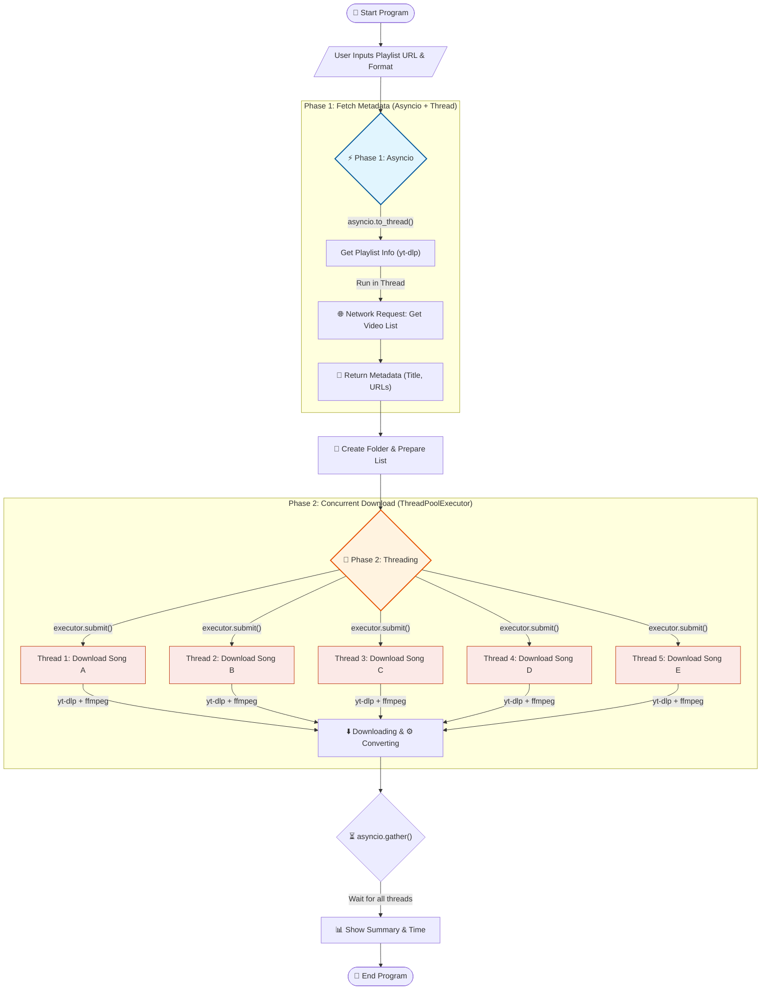

# YouTube Playlist Downloader

CLI สำหรับดาวน์โหลด YouTube Playlist แบบ Concurrent

---

**240-123 Module Data Structure, Algorithms and Programming**

---

## 🎬 Demo


---

## 🔄 โฟลว์ชาร์ตการทำงาน



---

## Dependencies

| Package                 | Description                                               |
| ----------------------- | --------------------------------------------------------- |
| `asyncio`               | ควบคุม event loop หลัก และ await การทำงานแบบ non-blocking |
| `asyncio.to_thread()`   | รัน blocking I/O (ดึง metadata) โดยไม่บล็อก event loop    |
| `ThreadPoolExecutor`    | ดาวน์โหลดหลายไฟล์พร้อมกัน (I/O-bound task)                |
| `asyncio.wrap_future()` | แปลง `concurrent.futures.Future` → `asyncio.Future`       |
| `asyncio.gather()`      | รอผลลัพธ์จากทุก thread พร้อมกัน                           |
| `yt-dlp`                | ดึง metadata และดาวน์โหลดไฟล์จาก YouTube                  |

---

## โครงสร้างโปรเจกต์

```
youtube-playlist-downloader/
├── downloader.py        # ไฟล์หลักของโปรแกรม
├── requirements.txt     # dependencies
└── README.md            # เอกสารโปรแกรม
```

---

## วิธีติดตั้งและใช้งาน

### 1. Clone โปรเจกต์

```bash
git clone https://github.com/your-username/youtube-playlist-downloader.git
cd youtube-playlist-downloader
```

### 2. ติดตั้ง Dependencies

```bash
pip install -r requirements.txt
```

> ⚠️ ต้องติดตั้ง **FFmpeg** ก่อนหากต้องการดาวน์โหลด MP3

```bash
# macOS
brew install ffmpeg

# Ubuntu / Debian
sudo apt install ffmpeg

# Windows (ผ่าน winget)
winget install ffmpeg
```

### 3. รันโปรแกรม

```bash
python downloader.py
```

### 4. ทำตามขั้นตอน

```
Enter playlist URL: https://www.youtube.com/playlist?list=PLxxxx
Select download format:
  1. MP3 (Audio only)
  2. MP4 (Video + Audio)
Enter choice (1 or 2): 1
```

ไฟล์จะถูกบันทึกในโฟลเดอร์ชื่อเดียวกับ Playlist โดยอัตโนมัติ

---

## 🔍 อธิบาย Concurrency แต่ละส่วน

1. ดึงข้อมูล (Phase 1): ใช้ asyncio.to_thread ส่งงานดึงรายชื่อเพลง (ซึ่งช้า) ไปทำใน Thread แยก เพื่อให้โปรแกรมหลักไม่ค้าง

2. ดาวน์โหลด (Phase 2): ใช้ ThreadPoolExecutor สร้างคนงาน 5 คน (Thread) ช่วยกันรุมดาวน์โหลดเพลงพร้อมกันทีละ 5 เพลง

3. รอผล (Waiting): ใช้ asyncio.gather รอให้คนงานทั้ง 5 คนทำงานเสร็จทั้งหมด แล้วค่อยสรุปผลทีเดียว

---

## ⚠️ ข้อควรระวัง

- การดาวน์โหลดจาก YouTube อาจขัดกับ Terms of Service ของ YouTube ควรใช้เพื่อวัตถุประสงค์ส่วนตัวเท่านั้น
- บางวิดีโออาจมีการป้องกัน DRM หรือถูก region-lock ทำให้ดาวน์โหลดไม่ได้

---

## 👤 ผู้พัฒนา

6810110135 นายธนพิพัฒน์ จันทร์สุวรรณ์ จัดทำเพื่อการเรียนรู้ Python Concurrency
