# YouTube Playlist Downloader

CLI สำหรับดาวน์โหลด YouTube Playlist แบบ Concurrent

---

**240-123 Module Data Structure, Algorithms and Programming**

---

## 🎬 Demo


---

## 🔄 โฟลว์ชาร์ตการทำงาน

```mermaid
flowchart TD
    Start([🚀 Start Program]) --> Input[/User Inputs Playlist URL & Format/]
    Input --> AsyncPhase1{⚡ Phase 1: Asyncio}

    subgraph Phase1 ["Phase 1: Fetch Metadata (Asyncio + Thread)"]
        AsyncPhase1 -- "asyncio.to_thread()" --> Fetch["Get Playlist Info (yt-dlp)"]
        Fetch -- "Run in Thread" --> Net1["🌐 Network Request: Get Video List"]
        Net1 --> ReturnMeta["📄 Return Metadata (Title, URLs)"]
    end

    ReturnMeta --> Setup["📂 Create Folder & Prepare List"]
    Setup --> AsyncPhase2{🧵 Phase 2: Threading}

    subgraph Phase2 ["Phase 2: Concurrent Download (ThreadPoolExecutor)"]
        AsyncPhase2 -- "executor.submit()" --> T1["Thread 1: Download Song A"]
        AsyncPhase2 -- "executor.submit()" --> T2["Thread 2: Download Song B"]
        AsyncPhase2 -- "executor.submit()" --> T3["Thread 3: Download Song C"]
        AsyncPhase2 -- "executor.submit()" --> T4["Thread 4: Download Song D"]
        AsyncPhase2 -- "executor.submit()" --> T5["Thread 5: Download Song E"]

        T1 & T2 & T3 & T4 & T5 -- "yt-dlp + ffmpeg" --> Process["⬇️ Downloading & ⚙️ Converting"]
    end

    Process --> Wait{"⏳ asyncio.gather()"}
    Wait -- "Wait for all threads" --> Summary["📊 Show Summary & Time"]
    Summary --> End([🏁 End Program])

    style AsyncPhase1 fill:#e1f5fe,stroke:#01579b,stroke-width:2px
    style AsyncPhase2 fill:#fff3e0,stroke:#e65100,stroke-width:2px
    style T1 fill:#fbe9e7,stroke:#bf360c
    style T2 fill:#fbe9e7,stroke:#bf360c
    style T3 fill:#fbe9e7,stroke:#bf360c
    style T4 fill:#fbe9e7,stroke:#bf360c
    style T5 fill:#fbe9e7,stroke:#bf360c
```



---

## Dependencies

| Package                 | Description                                               |
| ----------------------- | --------------------------------------------------------- |
| `asyncio`               | ควบคุม event loop หลัก และ await การทำงานแบบ non-blocking |
| `asyncio.to_thread()`   | รัน blocking I/O (ดึง metadata) โดยไม่บล็อก event loop    |
| `ThreadPoolExecutor`    | ดาวน์โหลดหลายไฟล์พร้อมกัน (I/O-bound task)                |
| `asyncio.wrap_future()` | แปลง `concurrent.futures.Future` → `asyncio.Future`       |
| `asyncio.gather()`      | รอผลลัพธ์จากทุก thread พร้อมกัน                           |
| `yt-dlp`                | ดึง metadata และดาวน์โหลดไฟล์จาก YouTube                  |

---

## โครงสร้างโปรเจกต์

```
youtube-playlist-downloader/
├── downloader.py        # ไฟล์หลักของโปรแกรม
├── requirements.txt     # dependencies
└── README.md            # เอกสารโปรแกรม
```

---

## วิธีติดตั้งและใช้งาน

### 1. Clone โปรเจกต์

```bash
git clone https://github.com/your-username/youtube-playlist-downloader.git
cd youtube-playlist-downloader
```

### 2. ติดตั้ง Dependencies

```bash
pip install -r requirements.txt
```

> ⚠️ ต้องติดตั้ง **FFmpeg** ก่อนหากต้องการดาวน์โหลด MP3

```bash
# macOS
brew install ffmpeg

# Ubuntu / Debian
sudo apt install ffmpeg

# Windows (ผ่าน winget)
winget install ffmpeg
```

### 3. รันโปรแกรม

```bash
python downloader.py
```

### 4. ทำตามขั้นตอน

```
Enter playlist URL: https://www.youtube.com/playlist?list=PLxxxx
Select download format:
  1. MP3 (Audio only)
  2. MP4 (Video + Audio)
Enter choice (1 or 2): 1
```

ไฟล์จะถูกบันทึกในโฟลเดอร์ชื่อเดียวกับ Playlist โดยอัตโนมัติ

---

## 🔍 อธิบาย Concurrency แต่ละส่วน

1. ดึงข้อมูล (Phase 1): ใช้ asyncio.to_thread ส่งงานดึงรายชื่อเพลง (ซึ่งช้า) ไปทำใน Thread แยก เพื่อให้โปรแกรมหลักไม่ค้าง

2. ดาวน์โหลด (Phase 2): ใช้ ThreadPoolExecutor สร้างคนงาน 5 คน (Thread) ช่วยกันรุมดาวน์โหลดเพลงพร้อมกันทีละ 5 เพลง

3. รอผล (Waiting): ใช้ asyncio.gather รอให้คนงานทั้ง 5 คนทำงานเสร็จทั้งหมด แล้วค่อยสรุปผลทีเดียว

---

## ⚠️ ข้อควรระวัง

- การดาวน์โหลดจาก YouTube อาจขัดกับ Terms of Service ของ YouTube ควรใช้เพื่อวัตถุประสงค์ส่วนตัวเท่านั้น
- บางวิดีโออาจมีการป้องกัน DRM หรือถูก region-lock ทำให้ดาวน์โหลดไม่ได้

---

## 👤 ผู้พัฒนา

6810110135 นายธนพิพัฒน์ จันทร์สุวรรณ์ จัดทำเพื่อการเรียนรู้ Python Concurrency
